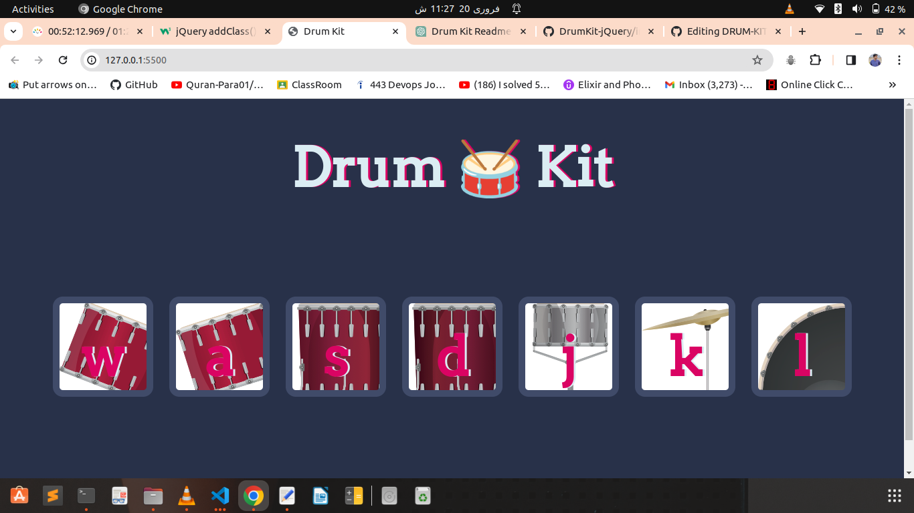

# DRUM-KIT-jQuery
This repository contains the source code for a simple Drum Kit web application built using jQuery. With this application, users can play drum sounds by either clicking on the corresponding buttons or pressing the associated keyboard keys.

# Features
- Seven drum buttons corresponding to keys 'w', 'a', 's', 'd', 'j', 'k', and 'l'.  
- Each button produces a different drum sound.  
- Users can either click on the buttons or press the associated keyboard keys to play sounds.  
- Visual feedback in the form of button animation upon interaction.  

# Technologies Used
- HTML  
- CSS  
- jQuery  

